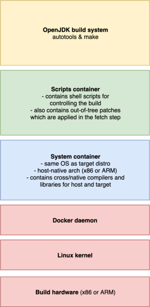
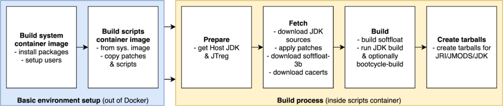

## Building OpenJDK

### Intro

The goal of this project is to provide a small enough Java runtime that
would run on ev3dev on EV3. Currently OpenJDK is used for this.
The reason is simple - it contains an Oracle-developed and then
opensourced fast ARM32 JIT from JDK9 onwards. The second reason is that
leJOS EV3 had used a similar JDK (Embedded JDK 7/8), but it was a
proprietary offering prepared and not later updated by Oracle.

### Build system


To build the OpenJDK binaries in an environment suitable for
cross-compilation for EV3, the repository is using a couple of Docker
containers. They have two variants: `native` (ARM host -> ARM target) and
`cross` (x86 host -> ARM target). The native builders have an advantage
in that the JDK can be partially tested right on the build machine.



The layers of the build environment are shown on the picture above.
The lower docker container/image contains the target OS (Debian/ev3dev)
with its libraries and compilers. This is done to ensure that the API
provided by the system and its libraries are compatible between the build
and target machines.

On top of that, there resides a set of shell scripts which control the build.
Their task is to download JDK and source-level dependencies and to build
the JDK binaries with its build system.

These two containers have to be built before the build of OpenJDK itself.
Afterwards, the scripts in the upper container take over the rest of
the build process.

It should be notes that as the builds run in a container, it is
necessary to mount a directory from the host to the container as
a build workspace. This makes it possible to access the built binaries.

### Build scripts

Let's return back to the scripts. There are six build scripts in total:
 * `autobuild.sh` - This is the entrypoint for the build.
                    It calls the last four scripts in succession
                    if autobuild is enabled. Otherwise it just exits
                    into shell.
 * `config.sh`
   - This script is `source`'d from the last four scripts.
   - It takes in the JDK version and other parameters from environment
     variables passed to the container and in turn it exports different
     environment variables to be used by other build scripts
     (like the JDK source URL).
 * `prepare.sh` - This script contains the *Prepare* phase.
   1. It downloads and unpacks the Host JDK (needed for OpenJDK build)
      to a directory in the build workspace. This is then used to build
      the Java classes of the resulting JDK.
   2. It also downloads JTreg, which is used when building included
      test cases (not currently run on Jenkins; but they can be run manually).
 * `fetch.sh` - This scripts contains the *Fetch* phase.
   1. It determines the SCM parameters (commit hash, real version).
      From them, it generates a metadata file used to identify the build.
      Usually the latest GA release is picked.
   2. It then has to download the OpenJDK source code.
   3. It applies the patches stored in this repository.
   4. It clones one extra repository - the AdoptOpenJDK
      [openjdk-build][bld] repository used for the CA certificates.
 * `build.sh` - This script is doing the *Build* phase.
   1. It configures the JDK build using the `configure` script.
   2. It runs the JDK build using `make`.
      - If the build is running on native (ARM) hardware, it also runs a
        bootcycle build, which uses the newly built JDK to build itself
        once more. This provides a basic level of testing.
 * `zip.sh` - This script finishes the build with the *Archiving* stage.
   1. It generates the JRI (Java Runtime Image) for the EV3,
      which is basically a reduced Java runtime.
   1. It then packs that and remaining build outputs (such as JMOD
      packages and the full JDK) into a tarball which is then uploaded
      as a build artifact.

[bld]: https://github.com/adoptopenjdk/openjdk-build



### Build parameters

The build scripts accept a predefined set of environment variables
describing the build. The parameters need to be passed in via Docker
environment variables; see [Manual build](#manual-build) for an example.

 * `JDKVER` - sets the JDK version to build.
   - One of `11`, `12`, `13`, `tip`, `loom`.
     Numeric versions will usually build the latest tagged
     General-Availability releases; `tip` will build the latest commit.
     - *Note.* When a new JDK version is branched out for stabilization,
       then the latest non-GA tag must used, as there are no GA tags yet.
 * `JDKVM` - sets the JVM JIT to use. One of:
   - `zero`: portable non-assembler JIT/interpreter.
             It's quite slow, but it should always work.
   - `client`: fast ARM assembler-assisted JIT.
   - `minimal`: similar to `client`, but should be a bit smaller.
                Unfortunately, this configuration does not build
                successfully (the linking process will fail).
 * `JDKPLATFORM` - sets the platform for the build scripts. Only `ev3` is allowed.
 * `JDKDEBUG` - sets the JVM debug level. Optional. One of (from JDK source):
   - `release`: no debug information, all optimizations, no asserts.
   - `optimized`: no debug information, all optim., no asserts, HS tgt is 'optimized'.
   - `fastdebug`: debug information (-g), all optimizations, all asserts
   - `slowdebug`: debug information (-g), no optimizations, all asserts
 * `AUTOBUILD` - when set to `1` or `yes`, it runs the autorun.sh script
                 directly instead of the shell.

### Build outputs

The output of the build process are three different archives:
 * `jmods-ev3.tar.gz` - contains Java JMODs.
   These are pieces of the JDK that can be assembled into a proper and
   useful JRE/JDK/JRI; see [here][jmod]. They are intended to be
   processed with the jlink tool provided with host-native Java JDK.
 * `jri-ev3.tar.gz` - EV3 JRI.
   This is a smaller version of traditional JRE. It is intended to be
   used as a Java runtime for the brick. It contains only a few Java
   modules in order to reduce its size.
 * `jdk-ev3.tar.gz` - Full EV3 JDK. This directory comes from the JDK
   build process; however, it is likely also built internally using jlink.
   This could be useful for someone who wants to do full Java
   development on the brick.

[jmod]: https://www.developer.com/java/data/how-modules-are-packaged-in-java-9.html

### Manual build
You can run the build OpenJDK on your own computer too. This script should do that:

```sh
# define parameters
TARGET_WORKSPACE="$(pwd)/build" # 10 GB of free space should be sufficient
TARGET_DEBIAN_VERSION="stretch" # stretch or buster
TARGET_OPENJDK_VERSION="11"     # 11, 12, 13, tip, loom are on Jenkins

# clone repository
git clone https://github.com/ev3dev-lang-java/openjdk-ev3.git
cd openjdk-ev3

# prepare working directory
mkdir -p "$TARGET_WORKSPACE"
chmod -R 777 "$TARGET_WORKSPACE" # docker may not share UID with the current user

# build base system container
docker build --build-arg DEBIAN_RELEASE="$TARGET_DEBIAN_VERSION" \
             --build-arg ARCH="armel" \
             --tag "ev3dev-lang-java:jdk-cross-$TARGET_DEBIAN_VERSION" \
             --file ./system/Dockerfile.cross \
             ./system

# on top of that, create a build scripts container
docker build --build-arg commit="$(git rev-parse HEAD)" \
             --build-arg extra="Manual build #1 by $(whoami)" \
             --build-arg DEBIAN_RELEASE="$TARGET_DEBIAN_VERSION" \
             --build-arg BUILD_TYPE="cross" \
             --tag "ev3dev-lang-java:jdk-cross-build" \
             ./scripts

# now run the build
docker run --rm \
           --interactive \
           --tty \
           --volume "$TARGET_WORKSPACE:/build" \
           --env JDKVER="$TARGET_OPENJDK_VERSION" \
           --env JDKVM="client" \
           --env JDKPLATFORM="ev3" \
           --env JDKDEBUG="release" \
           --env AUTOBUILD="1" \
           ev3dev-lang-java:jdk-cross-build

# finally, make workspace accessible for all users (i.e. current one too)
chmod -R 777 "$TARGET_WORKSPACE"
# and list the output directory (now it should contain three *-ev3.tar.gz files)
ls "$TARGET_WORKSPACE"
```

See [issue #34][manual_build].

[manual_build]: https://github.com/ev3dev-lang-java/openjdk-ev3/issues/34
