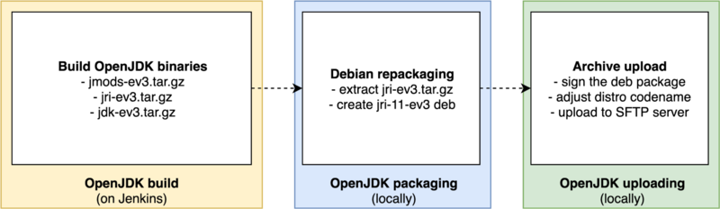

# OpenJDK-EV3 Maintainer's Manual

This manual goes through an overview of this project.
It is a version of the [old manual](https://docs.google.com/document/d/1rsBDU68_ETXm9b_Lb4b6oPVBbNwT9f4xEua2w3-Pm6A)
converted to pure Markdown.

Contents:
 * [Building OpenJDK](Building.md)
 * [Included out-of-tree patches](Included_patches.md)
 * [Debugging issues with OpenJDK](Debugging.md)
 * [Adding new major OpenJDK version](Adding_new_major_OpenJDK_version.md)
 * [Packaging, signing and uploading for ev3dev](Packaging_signing_uploading.md)
 * [Integration with AdoptOpenJDK Jenkins](AdoptOpenJDK_Jenkins.md)
 * [Ideas about testing the builds](Testing_ideas.md)
